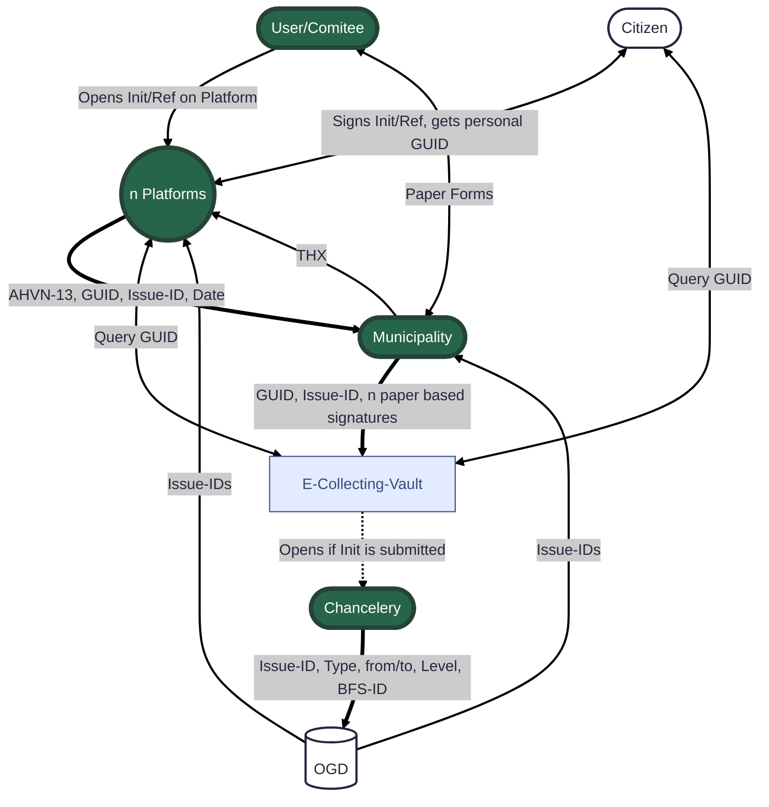

# 2) E-Collecting vom bestehenden Stimmregister aus gedacht

Städte und Gemeinden sind verantwortlich für die Unterschriftenkontrolle von Initiativen, Referenden und Wahlvorschläge. Sie prüfen dabei Willensbekundungen aller föderalen Ebenen - von der eidg. Initiative bis zum Gemeinderats-Wahlvorschlag. 
Für die Kontrolle der heutigen Papierbogen nutzen sie ein kommunales Fachsystem. Diese Fachlösungen sind auf die Bedürfnisse der jeweiligen kommunalen Verwaltung zugeschnitten, ist bewährt, geniessen ein grosses Vertrauen und werden in der ganzen Schweiz eingesetzt. 

## Approach

Bestehende Infrastrukturen sollen weiter genutzt und bewährte Abläufe/Lösungen verwendet werden können. Idealerweise kann das kommunale Fachsystem auch in Kombination mit e-Collecting genutzt werden – oder für e-Collecting erweitert werden.
Am Hackathon möchten wir uns auf die Identifikation und Definition von Schnittstellen zwischen den einzelnen Akteuren (e-Collecting-Plattform, Gemeinde-Fachsystem, ..) fokusieren. 
Welche Schnittstellen, welche Meldeflüsse mit welchen Daten sind nötig? 
Gibt es bereits entsprechende Standard-Definitionen (eCH) oder welche müssten erstellt werden?
Wie können Geschäfte eindeutig identifiziert werden?

## Topics addressed

| Topic | (How) is it addressed? |
| -| ------- |
| 8 | *Der Papierkanal wird während der Versuche weiterhin bestehen bleiben. Wie können beide Kanäle kombiniert und dabei Mehrfachunterschriften verhindert werden?*   Durch die Kombination und Verschmelzung von Papierkanal und e-Collecting auf der gleichen Datenbasis wird sichergestellt, dass Mehrfachunterschriften über unterschiedliche Kanäle verhindert werden. |
| 9 | *Erleichterte Einführung für Gemeinden mit Effizienzgewinn; auf der Grundlage von bestehender Infrastruktur und bestehenden Prozessen*   Die Gemeinden verfügen bereits über bewährte Fachsysteme zur Unterschriftenkontrolle. Diese sollen nicht durch neue Parallelstrukturen ersetzt, sondern für e-Collecting erweitert werden. So können bestehende Abläufe und Infrastrukturen weiter genutzt werden. Gemeinden profitieren von Effizienzgewinnen, weil Papier- und elektronische Unterschriften über das gleiche System geprüft werden. Das spart Ressourcen, schafft Vertrauen und ermöglicht eine schnelle Einführung von e-Collecting. |
| 6 | *Verhinderung unterschlagener Unterstützungsbekundungen*   Über die zu definierende Schnittstelle zwischen E-Collecting-Portal und BK sowie kommunalem Fachsystem und BK sollen Prüfwerte zur Kontrolle ausgetauscht werden. |
| 7 | *Wahrung des Stimmgeheimnisses*   Über die zu definierenden Schnittstellen zwischen allen Beteiligten (E-Collecting-Portal, Komitee, kommunalem Fachsystem und BK) sollen nur die notwendigen Daten und Informationen ausgetauscht werden. |
| ... |  |

# Lösungsmöglichkeit

## Gesamtübersicht

## Teilprozesse

### Open-Government-Data-Plattform ###
Im Rahmen der Bereitstellung von Volksbegehren soll die Publikation der Schnittstellen über die i14y-Plattform des Bundes (https://www.i14y.admin.ch/de/home) erfolgen.
Die Plattform i14y bietet sich insbesondere an, da sie für alle föderalen Ebenen – Bund, Kantone und Gemeinden – konzipiert und nutzbar ist und somit eine zentrale, standardisierte Anlaufstelle für offene Schnittstellen darstellt.
VBG-Datensatz
Für die Veröffentlichung ist vorgesehen, einen VBG-Datensatz (Volksbegehren/Geschäfte) mit folgenden Attributen bereitzustellen:
- ID-VBG (eindeutige Kennung des politischen Geschäfts)
- Komitee (Name des Komitees)
- Titel
- Beschreibung (Kurzbeschreibung der Initiative)
- Sammelfristen (relevante Fristen)
Da diese Informationen ohnehin öffentlich zugänglich sind (z. B. über das Amtsblatt oder andere Publikationskanäle) und im Rahmen des Gesamtkonzepts mehreren Systemen zur Verfügung gestellt werden müssen, bietet sich die Publikation im Rahmen von Open Government Data (OGD) ausdrücklich an.
**Anforderungen:**
- Die lesenden Endpunkte (Read-APIs) sind öffentlich zugänglich und werden auf der i14y-Plattform gelistet.
- Die schreibenden Endpunkte (Write-APIs) zur Erfassung oder Aktualisierung von VBG-Datensätzen – beispielsweise durch Kanzleien – sind nicht öffentlich, benötigen eine Authentifizierung und fallen somit nicht unter OGD.
- Für den Datenaustausch wird das entsprechende eCH-Standardformat eCH-XY implementiert, um die Interoperabilität mit anderen Verwaltungssystemen sicherzustellen.

### E-Collecting-Tresor ###
Ein Grundbaustein unserer Lösungsidee ist der sogenannte E-Collecting-Tresor. In diesem Tresor wird pro Volksbegehren eine eigene Datenbank geführt. 
In dieser Datenbank wird jede Willensbekundung gespeichert. 
Eine Willensbekundung enthält folgende Daten: 
- EC-GUID resp. P-GUID
- Datum der Einreichung

In diesem Tresor werden alle Willensbekundungen gehalten. Dieser Tresor enthält jedoch keine Informationen zu Personendaten und enthält somit keine sensiblen Datensätze um zu einer Gesinnungsdatenbank zu werden.  

Die Datenbank ist unterteilt in einen geschlossene und einen freigegebene Datenbereich. Die Kanzlei hat Einsicht in den freigebenen Datenbereich und kann die Willensbekundungen nach Ablauf und Einreichung der Sammelfrist ansehen und prüfen. 

Der Tresor enthält auch eine Schnittstelle zur Prüfung der Willensbekundung. Jede Sammel-Organisation kann via Plattform prüfen, wie viele Willensbekundungen durch den gesamten Unterschrift durch sie gesammelt wurden. Dazu kann die Plattform die Sammelorganisation an den Tresor senden und dieser antwortet, ob die Willensbekundung vorhanden ist oder nicht. Falls diese nicht vorhanden ist, kann es sein, dass die Gemeinde die Willensbekundung noch nicht vollständig geprüft und verarbeitet hat. 

**Anforderungen:**
- Login für Kanzlei und Zugriffssteuerung auf jeweilige Volksbegehren auf Stufe Bund, Kanton oder Gemeinde
- Login für Komitee bei einer Initiative
- Schnittstelle für Sammelorganisation
- Freigabe und Rückzugsmöglichkeit durch Komitee

### Kanzlei (Bundeskanzlei, Kantons- resp. Staatskanzlei, Gemeindekanzlei)

Ein Komitee möchte eine neue Initiative lancieren. Dazu wird diese Initiative bei der Kanzlei eingereicht. Je nachdem, ob die Initiative auf Bundes-, Kantons- oder Gemeindeebene eingereicht wurde, wird die entsprechende Kanzlei damit beauftragt, die Initiative zu prüfen. Wenn die Initiative bewilligt wird, wird sie im nächsten Schritt im Open-Government-Data-Portal veröffentlicht. Dabei erhält die Initiative eine eindeutige Identifikation, die sogenannte **ID-Volksbegehren**, sowie die dazugehörigen Metadaten wie die Sammelfrist, die Initiativbezeichnung oder das Komitee. (*siehe Schema XY*)

Pro Initiative erstellt die Kanzlei im E-Collecting-Tresor des Bundes ein Login für das Komitee. Dieses Login ermöglicht dem Komitee, auf die gesammelten Unterschriften zuzugreifen und diese bei Abschluss freizugeben, ähnlich wie bei Unterschriften auf Papier, die bei der Kanzlei eingereicht werden. Dieses Login wird auf Stufe Bund, Kanton oder Gemeinde erstellt.

Möchte das Initiativkomitee die Initiative zurückziehen, ist auch dies möglich. Der Rückzug einer Initiative wird bei der Kanzlei eingereicht, die daraufhin den gesamten Tresor mit allen bereits vorhandenen Willensbekundungen entfernt bzw. löscht, sodass niemand außer dem Komitee erfährt, wie viele Stimmen effektiv abgegeben wurden.

Jeder referendumsfähige Beschluss wird publiziert. Neu wird auch dieser Beschluss im Open-Government-Data-Portal veröffentlicht. Falls der Beschluss noch keine ID-Volksbegehung hat, wird diese bei der Veröffentlichung generiert. Auch bei einem Referendum werden Metadaten hinzugefügt, beispielsweise die Referendumsfrist oder die Bezeichnung des Beschlusses.

## Prozessablauf einer digitalen Willensbekundung

## Contributing

Please read [CONTRIBUTING.md](/CONTRIBUTING.md) for details on our code of conduct.

## Team Members

- [Benjamin Meile](https://github.com/benjaminmeile)
- [Severin Graf](https://github.com/sevigraf) 
- [Simon Graf](https://github.com/simgraworldwide)
- Florian Wahl
- Jorgo Ananiadis

## Mermaid

## License

This software is licensed under a AGPL 3.0 License - see the [LICENSE](LICENSE) file for details. Please feel free to [choose any other](https://choosealicense.com/) [Open Source Initiative approved license](https://opensource.org/licenses) (e.g. a permissive license such as [MIT](https://opensource.org/license/mit)). Other content (e.g. text, images, etc.) is licensed under a [Creative Commons CC BY-SA 4.0 license](https://creativecommons.org/licenses/by-sa/4.0/deed.de). Exceptions are possible in consultation with the organizers.
