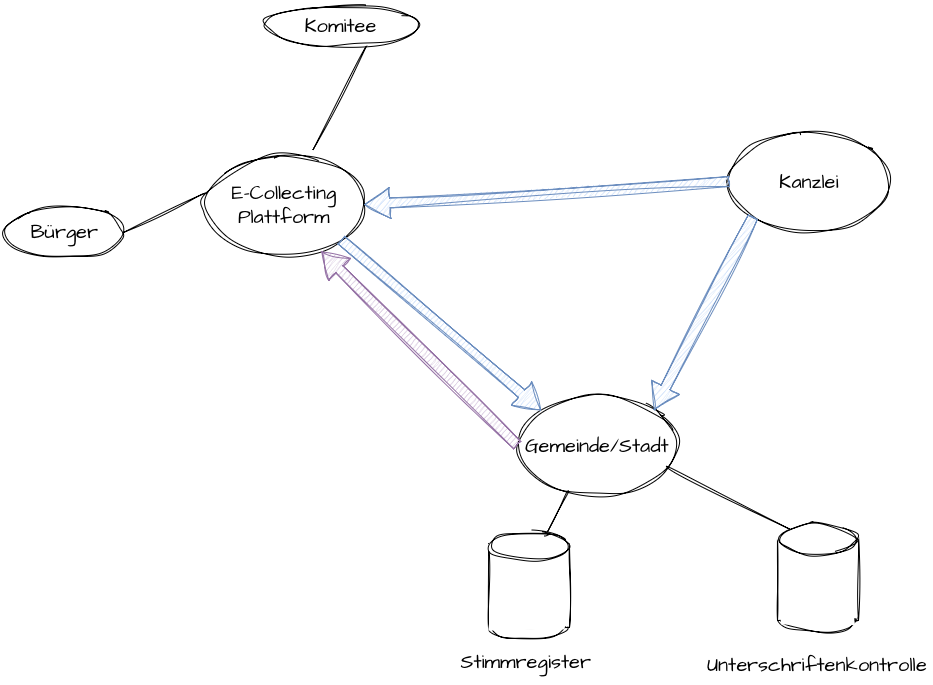
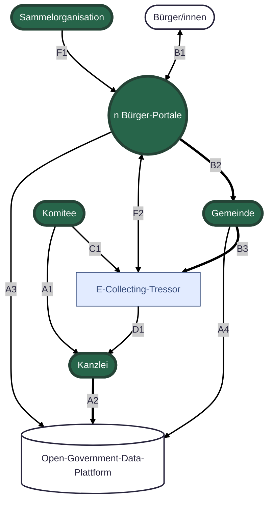
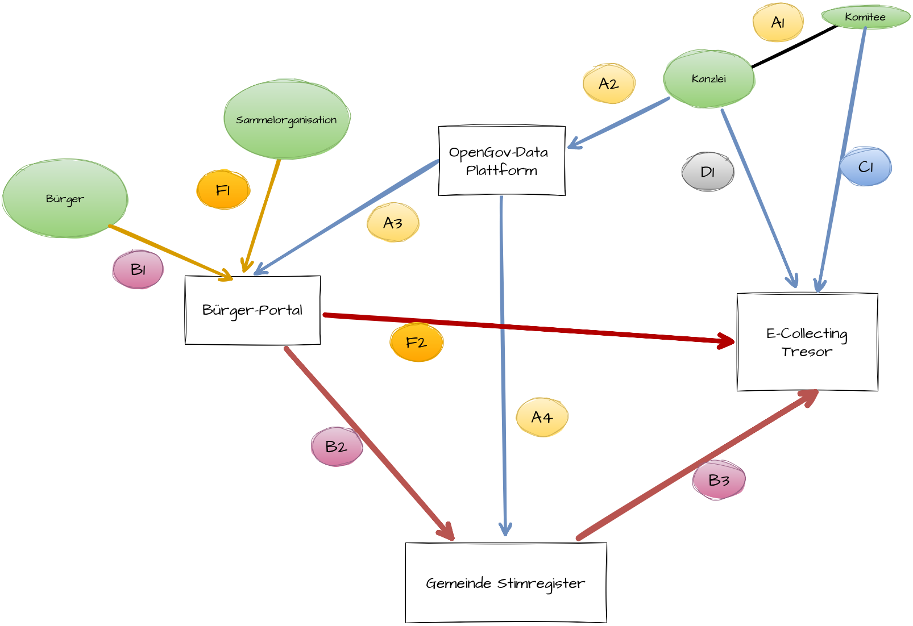
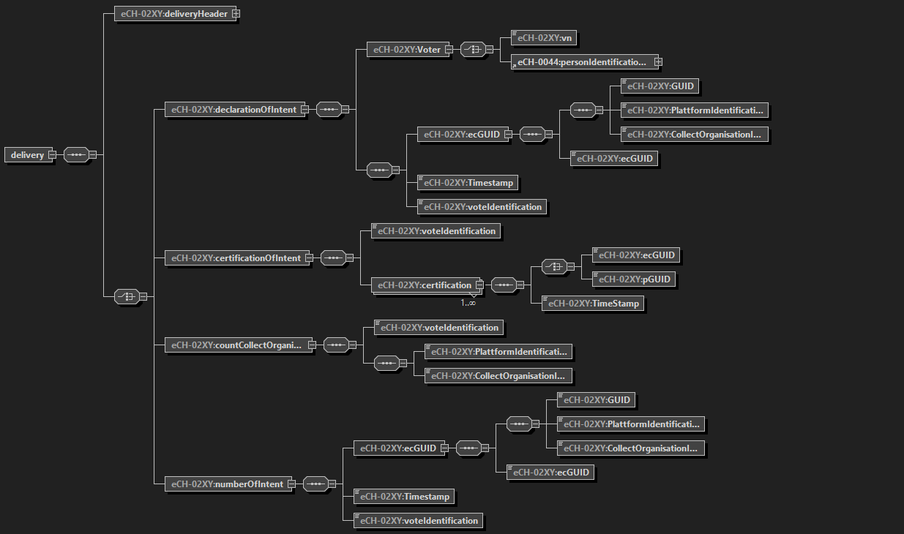

# 2) E-Collecting vom bestehenden Stimmregister aus gedacht

Städte und Gemeinden sind verantwortlich für die Unterschriftenkontrolle von Initiativen, Referenden und Wahlvorschläge. Sie prüfen dabei Willensbekundungen aller föderalen Ebenen - von der eidg. Initiative bis zum Gemeinderats-Wahlvorschlag. 
Für die Kontrolle der heutigen Papierbogen nutzen sie ein kommunales Fachsystem. Diese Fachlösungen sind auf die Bedürfnisse der jeweiligen kommunalen Verwaltung zugeschnitten, ist bewährt, geniessen ein grosses Vertrauen und werden in der ganzen Schweiz eingesetzt. 

## Approach

Bestehende Infrastrukturen sollen weiter genutzt und bewährte Abläufe/Lösungen verwendet werden können. Idealerweise kann das kommunale Fachsystem auch in Kombination mit e-Collecting genutzt werden – oder für e-Collecting erweitert werden.
Am Hackathon möchten wir uns auf die Identifikation und Definition von Schnittstellen zwischen den einzelnen Akteuren (e-Collecting-Plattform, Gemeinde-Fachsystem, ..) fokusieren. 
Welche Schnittstellen, welche Meldeflüsse mit welchen Daten sind nötig? 
Gibt es bereits entsprechende Standard-Definitionen (eCH) oder welche müssten erstellt werden?
Wie können Geschäfte eindeutig identifiziert werden?

## Topics addressed

| Topic | (How) is it addressed? |
| -| ------- |
| 8 | *Der Papierkanal wird während der Versuche weiterhin bestehen bleiben. Wie können beide Kanäle kombiniert und dabei Mehrfachunterschriften verhindert werden?*   Durch die Kombination und Verschmelzung von Papierkanal und e-Collecting auf der gleichen Datenbasis wird sichergestellt, dass Mehrfachunterschriften über unterschiedliche Kanäle verhindert werden. |
| 9 | *Erleichterte Einführung für Gemeinden mit Effizienzgewinn; auf der Grundlage von bestehender Infrastruktur und bestehenden Prozessen*   Die Gemeinden verfügen bereits über bewährte Fachsysteme zur Unterschriftenkontrolle. Diese sollen nicht durch neue Parallelstrukturen ersetzt, sondern für e-Collecting erweitert werden. So können bestehende Abläufe und Infrastrukturen weiter genutzt werden. Gemeinden profitieren von Effizienzgewinnen, weil Papier- und elektronische Unterschriften über das gleiche System geprüft werden. Das spart Ressourcen, schafft Vertrauen und ermöglicht eine schnelle Einführung von e-Collecting. |
| 6 | *Verhinderung unterschlagener Unterstützungsbekundungen*   Über die zu definierende Schnittstelle zwischen E-Collecting-Portal und BK sowie kommunalem Fachsystem und BK sollen Prüfwerte zur Kontrolle ausgetauscht werden. |
| 7 | *Wahrung des Stimmgeheimnisses*   Über die zu definierenden Schnittstellen zwischen allen Beteiligten (E-Collecting-Portal, Komitee, kommunalem Fachsystem und BK) sollen nur die notwendigen Daten und Informationen ausgetauscht werden. |

# Lösungsmöglichkeit im dezentralen Ansatz

## Managment-Summary ##

Das Projekt E-Collecting vom bestehenden Stimmregister aus gedacht verfolgt das Ziel, die bestehenden kommunalen Fachsysteme zur Unterschriftenkontrolle um digitale Kanäle zu erweitern und so die Grundlage für ein schweizweit einheitliches, sicheres und effizientes E-Collecting-Verfahren zu schaffen. Im Zentrum steht die Weiterverwendung bewährter kommunaler Infrastrukturen und Prozesse, kombiniert mit klar definierten Schnittstellen zu neuen digitalen Komponenten wie Bürgerportalen, E-Collecting-Tresoren und den Open-Government-Data-(OGD)-Plattformen.

**Ausgangslage**

Städte und Gemeinden sind heute für die Prüfung von Unterschriften sämtlicher Volksbegehren auf allen föderalen Ebenen verantwortlich. Diese Aufgabe erfolgt bisher mit etablierten Fachsystemen, die grosses Vertrauen geniessen und schweizweit im Einsatz sind. Dieses bewährte Fundament soll gezielt genutzt und um digitale Komponenten erweitert werden. 

**Zielsetzung**

Das Projekt zeigt auf, wie E-Collecting technisch und organisatorisch in die bestehenden kommunalen Abläufe integriert werden kann. Dabei liegt der Fokus nicht auf der vollständigen Systementwicklung, sondern auf der Klärung der Voraussetzungen für eine interoperable, föderal abgestützte Lösung.
Am Hackathon fokusieren wir uns auf die Identifikation und Definition der Schnittstellen zwischen den einzelnen Akteuren. 
Welche Schnittstellen und Meldeflüsse mit welchen Daten sind erforderlich? Gibt es bereits passende eCH-Standarddefinitionen oder müssen neue geschaffen werden und wie können Volksbegehren bzw. Geschäfte eindeutig identifiziert werden.

**Lösungsansatz**

Das Konzept sieht einen dezentralen Ansatz vor, bei dem Bürgerportale als Frontend für die digitale Willensbekundung fungieren. Nach der Identifikation (z. B. via eID) wird die digitale Unterschrift in Form einer anonymisierten EC-GUID erzeugt und über die Sedex-Schnittstelle an die zuständige Gemeinde übermittelt. Diese prüft die Stimmberechtigung auf Basis des kommunalen Stimmregisters und bescheinigt die Willensbekundung – analog zu den heutigen Papierprozessen. Alle gültigen Datensätze werden im E-Collecting-Tresor abgelegt, der als zentrale, aber datenschutzkonforme Sammelstelle dient.
Parallel werden Volksbegehren und Metadaten über die Open-Government-Data-Plattform (i14y) bereitgestellt, um Transparenz und Nachvollziehbarkeit sicherzustellen.

**Vorteile**

Vertrauenswürdigkeit: Die Gemeinden bleiben zentrale Prüfstellen und behalten die Datenhoheit.
Skalierbarkeit: Das Modell funktioniert föderal über alle Ebenen hinweg.
Datenschutz: Es erfolgt keine Speicherung personenbezogener Daten ausserhalb des Gemeinde Fachsystems. 
Nachvollziehbarkeit: Einheitliche Identifikatoren (EC-GUID/P-GUID) und standardisierte Schnittstellen sichern Konsistenz und Prüfbarkeit.

**Nächste Schritte**

Die gewonnenen Erkenntnisse sollen mit bestehenden Lösungsideen von Bürgerportalen kombiniert werden, um ein durchgängiges, interoperables Gesamtkonzept zu skizzieren. Parallel dazu könnte die Finalisierung bzw. Erweiterung der nötigen eCH-Standards vorangetrieben werden, um eine technische Grundlage für die Kommunikation zwischen den Systemen zu schaffen.
Ebenso kann die Konzeption der Open-Government-Data-Plattform (i14y) konkretisiert werden, damit Volksbegehren und Metadaten künftig standardisiert publiziert und von allen beteiligten Systemen automatisiert bezogen werden können.
Diese Schritte schaffen die technische und organisatorische Grundlage für die Einführung eines sicheren, föderal abgestützten E-Collecting-Systems, das die Digitalisierung der direkten Demokratie in der Schweiz pragmatisch, vertrauenswürdig und anschlussfähig vorantreibt.

## Gesamtübersicht
Die Gesamtübersicht zeigt einen dezentralen und minimalinvasiven Ansatz auf. Nachfolgend wird der Prozess detailiert aufgezeigt.

## Teilprozesse
Nachfolged werden die einzelnen Teilprozesse und Akteure innerhalb dieses dezentralen Lösungsasatzes genauer definiert.

## Bürger-Portal ##

Das Bürger-Portal ist der Touchpoint des Bürgers in Bezug auf Volksbegehren und ist Teil einer übergeordneten n-Portal-Strategie. Dabei wird vorgesehen, dass mehrere Portale verschiedener Anbieter parallel existieren können.
Ein einzelnes Portal muss nicht zwingend alle Funktionen abdecken (z. B. Sammel-Organisationen oder spezielle Erweiterungen).
Verbindlich ist jedoch die Anbindung an die Sedex-Schnittstelle, um den Datenaustausch, Sicherheitsstandards und Anschlussfähigkeit zu gewährleisten. 
Die Volksbegehren (VBGs) können periodisch, beispielsweise alle 24 Stunden, über die OGD-Schnittstelle importiert werden. Dadurch ist gewährleistet, dass ein Portale stets über die aktuellen Informationen zu laufenden und neuen Volksbegehren verfügt.

*Funktionen für Bürgerinnen und Bürger*
Das Portal ermöglicht Bürgerinnen und Bürgern die digitale Abgabe einer Willensbekundung im Rahmen eines Volksbegehrens.
Die Kernfunktionen sind:
- Interaktion mit einem Volksbegehren (VBG) bzw. politischen Geschäft über das Portal.
- Identifikation des Bürgers, z. B. mittels eID oder einem vergleichbaren elektronischen Identifikationsverfahren.
- Abgabe der Willensbekundung nach erfolgreicher Identifikation.
- Bei der Abgabe wird eine GUID generiert und gespeichert, ohne Personenbezug (keine Zuordnung zum Bürger).
- Nur die GUID und der Zeitstempel wird im Portal gespeichert
- Informationen wie GUID, ID-Bürger, Zeitstempel, ID-Portal und optional ID-Sammelorganisation werden an die Gemeinde übermittelt.
- Nach Abschluss der Willensbekundung wird dem Bürger eine Bestätigung angezeigt und die zugehörige GUID zur Verfügung gestellt (z. B. als Download oder zur Integration in ein digitales Wallet).
- 
*Ablauf einer Willensbekundung*
1.	Auswahl des gewünschten Volksbegehrens.
2.	Identifikation des Bürgers (z. B. über eID).
3.	Bewusste Willensbekundung, optional mit zusätzlicher Verifikation (z. B. Video-Ident, 2FA).
4.	Rückgabe der ecGUID als Bestätigung in unterschiedlicher Form (z. B. Bild, Verifiable Credential, E-Mail) mit dem Hinweis: „Lade deine Bestätigung herunter.“

*Sammel-Organisationen*
Eine Sammel-Organisationen registriert sich auf einem Portal und kann über diesen Zugang:
- Sammelaktionen verwalten und
- einen individuellen QR-Code generieren, der eine spätere Auswertung aller digital gesammelten Willensbekundungen dieser Organisation ermöglicht.

*Übermittlung an die Gemeinde*
Nach erfolgreicher Willensbekundung wird der entsprechende Datensatz über die Sedex-Schnittstelle an die zuständige Gemeinde übermittelt (siehe [eCH-02XY](docs/eCH-02XY-1-0.xsd)).  
Die Gemeinde bestätigt den technischen Empfang durch eine Sedex-Quittung, verarbeitet die Meldung jedoch asynchron.

*Struktur der ecGUID*
Die ecGUID dient als technische Kennung einer digitalen Willensbekundung und setzt sich wie folgt zusammen:
[ID-Portal]_[ID-Sammlung]_[GUID]
Definitionen:
- ID-Plattform: Eindeutige Teilnehmer-ID der Plattform (z. B. Sedex-ID)
- ID-Sammlung: Optionale Kennung zur Identifikation einer Sammel-Organisation
- GUID: Systemgenerierte, eindeutige Kennung der Willensbekundung, ohne personenbezogene Informationen
- Weitere Metadaten:
  - Zeitstempel der Willensbekundung
  - ID-VBG: Kennung des durch die Kanzlei eröffneten Volksbegehrens
  - ID-Bürger: z. B. AHV-Nummer (zum Abgleich mit dem Stimmregister)

## Gemeinden / Stimmregister ##

Die Gemeinden sind für die Kontrolle der Unterschriften bzw. Willensbekundungen zuständig. Anhand der Einwohnerdaten kann die Gemeinde prüfen, ob eine Person stimmberechtigt ist. 
Beim Eingang von Papierbekundungen kontrolliert die Gemeinde das Stimmrecht und generiert pro Eintrag eine P-GUID. Die bescheinigten Unterschriftenbögen werden regelmäßig an die Komitees zurückgesendet. *Im Falle eines Referendums werden die Bögen direkt an die Kanzlei weitergeleitet. *

Digitale Willensbekundungen werden von x-beliebigen Bürgerportalen an die Gemeinden übermittelt. Die Übermittlung der Daten erfolgt mittels Sedex und im eCH-Format. Informationen zum Volksbegehren inklusive der Sammelfristen können bei Bedarf direkt über die Open-Government-Data-Plattform bezogen werden. 

In der Meldung vom Portal sind die ecGUID, die ID des Volksbegehrens sowie das Datum und die AHV-Nummer des Bürgers enthalten. Anhand der AHV-Nummer kann eine Bürgerin oder ein Bürger eindeutig identifiziert und auf stimmrecht geprüft werden. Ebenfalls kann die Gemeinde nun anhand der ID desVolksbegehrens automatisch eine Mehrfachunterschrift prüfen. 

Die Gemeinde kann die Willensbekundung nun automatisch oder halbautomatisch, mit Überprüfung durch einen Sachbearbeiter, in die Unterschriftenkontrolle eintragen und prüfen, ob diese Person stimmberechtigt ist und ob sie bereits eine Willensbekundung auf Papier oder digital eingereicht hat. 

Nach der Bescheinigung einer gültigen Unterschrift wird die ecGUID inklusive ID-Volksbegehren an den E-Collecting-Tresor weitergeleitet. (siehe [eCH-02XY](docs/eCH-02XY-1-0.xsd)) 

** P-GUID (optional)**
Die P-GUID ist der Gegensatz zur ecGUID. Pro gültigem Eintrag auf dem Unterschriftenbogen wird eine P-GUID direkt an den Tresor übermittelt. Damit wird den Komitee ermöglicht, ein gesamtübersicht aller gültigen Unterschriften auf einem Portal zu sehen. 
*Diese Erweiterung ist in unserem Prozess optional und dient nur den Komitee.*

**Anforderungen:**
- Unterstützung der neuen Schnittstellenstandards zum Empfang und Versand der Willensbekundung

### Open-Government-Data-Plattform ###
Im Rahmen der Bereitstellung von Volksbegehren soll die Publikation der Schnittstellen über die i14y-Plattform des Bundes (https://www.i14y.admin.ch/de/home) erfolgen.
Die Plattform i14y bietet sich insbesondere an, da sie für alle föderalen Ebenen – Bund, Kantone und Gemeinden – konzipiert und nutzbar ist und somit eine zentrale, standardisierte Anlaufstelle für offene Schnittstellen darstellt.
VBG-Datensatz
Für die Veröffentlichung ist vorgesehen, einen VBG-Datensatz (Volksbegehren/Geschäfte) mit folgenden Attributen bereitzustellen:
- ID-VBG (eindeutige Kennung des politischen Geschäfts)
- Komitee (Name des Komitees)
- Titel
- Beschreibung (Kurzbeschreibung der Initiative)
- Sammelfristen (relevante Fristen)
Da diese Informationen ohnehin öffentlich zugänglich sind (z. B. über das Amtsblatt oder andere Publikationskanäle) und im Rahmen des Gesamtkonzepts mehreren Systemen zur Verfügung gestellt werden müssen, bietet sich die Publikation im Rahmen von Open Government Data (OGD) ausdrücklich an.
**Anforderungen:**
- Die lesenden Endpunkte (Read-APIs) sind öffentlich zugänglich und werden auf der i14y-Plattform gelistet.
- Die schreibenden Endpunkte (Write-APIs) zur Erfassung oder Aktualisierung von VBG-Datensätzen – beispielsweise durch Kanzleien – sind nicht öffentlich, benötigen eine Authentifizierung und fallen somit nicht unter OGD.
- Für den Datenaustausch wird das entsprechende eCH-Standardformat eCH-0252 implementiert, um die Interoperabilität mit anderen Verwaltungssystemen sicherzustellen.

### E-Collecting-Tresor ###
Ein Grundbaustein unserer Lösungsidee ist der sogenannte E-Collecting-Tresor. In diesem Tresor wird pro Volksbegehren eine eigene Datenbank geführt. 
In dieser Datenbank wird jede Willensbekundung gespeichert. 
Eine Willensbekundung enthält folgende Daten: 
- ecGUID resp. pGUID
- Datum der Einreichung

In diesem Tresor werden alle Willensbekundungen gehalten. Dieser Tresor enthält jedoch keine Informationen zu Personendaten und enthält somit keine sensiblen Datensätze um zu einer Gesinnungsdatenbank zu werden.  

Die Datenbank ist unterteilt in einen geschlossene und einen freigegebene Datenbereich. Die Kanzlei hat Einsicht in den freigebenen Datenbereich und kann die Willensbekundungen nach Ablauf und Einreichung der Sammelfrist ansehen und prüfen. 

Der Tresor enthält auch eine Schnittstelle zur Prüfung der Willensbekundung. Jede Sammel-Organisation kann via Bürger-Potral prüfen, wie viele Willensbekundungen durch den gesamten Unterschrift durch sie gesammelt wurden. Dazu kann das Portal die Sammelorganisation-ID an den Tresor senden und dieser antwortet, ob die Willensbekundung vorhanden ist oder nicht. Falls diese nicht vorhanden ist, kann es sein, dass die Gemeinde die Willensbekundung noch nicht vollständig geprüft und verarbeitet hat. 

**Anforderungen:**
- Login für Kanzlei und Zugriffssteuerung auf jeweilige Volksbegehren auf Stufe Bund, Kanton oder Gemeinde
- Login für Komitee bei einer Initiative
- Schnittstelle für Sammelorganisation
- Freigabe und Rückzugsmöglichkeit durch Komitee

### Kanzlei (Bundeskanzlei, Kantons- resp. Staatskanzlei, Gemeindekanzlei)

Ein Komitee möchte eine neue Initiative lancieren. Dazu wird diese Initiative bei der Kanzlei eingereicht. Je nachdem, ob die Initiative auf Bundes-, Kantons- oder Gemeindeebene eingereicht wurde, wird die entsprechende Kanzlei damit beauftragt, die Initiative zu prüfen. Wenn die Initiative bewilligt wird, wird sie im nächsten Schritt im Open-Government-Data-Portal veröffentlicht. Dabei erhält die Initiative eine eindeutige Identifikation, die sogenannte **ID-Volksbegehren**, sowie die dazugehörigen Metadaten wie die Sammelfrist, die Initiativbezeichnung oder das Komitee.

Pro Initiative erstellt die Kanzlei im E-Collecting-Tresor des Bundes ein Login für das Komitee. Dieses Login ermöglicht dem Komitee, auf die gesammelten Unterschriften zuzugreifen und diese bei Abschluss freizugeben, ähnlich wie bei Unterschriften auf Papier, die bei der Kanzlei eingereicht werden. Dieses Login wird auf Stufe Bund, Kanton oder Gemeinde erstellt.

Möchte das Initiativkomitee die Initiative zurückziehen, ist auch dies möglich. Der Rückzug einer Initiative wird bei der Kanzlei eingereicht, die daraufhin den gesamten Tresor mit allen bereits vorhandenen Willensbekundungen entfernt bzw. löscht, sodass niemand außer dem Komitee erfährt, wie viele Stimmen effektiv abgegeben wurden.

Jeder referendumsfähige Beschluss wird publiziert. Neu wird auch dieser Beschluss im Open-Government-Data-Portal veröffentlicht. Falls der Beschluss noch keine ID-Volksbegehung hat, wird diese bei der Veröffentlichung generiert. Auch bei einem Referendum werden Metadaten hinzugefügt, beispielsweise die Referendumsfrist oder die Bezeichnung des Beschlusses.

## Prozessablauf einer digitalen Willensbekundung

## Topics addressed

| Prozess-Schritt | Beschreibung | Akteur |
| -| ------- |-|
| A1 | Komitee startet eine Volksinitiative und gibt diese bei der Kanzlei ein. Der Prozess von Eingabe, Prüfung, Rückfragen etc ist nicht Teil unseres Konzepts und kann nach Bedarf definiert werden | Komitee und Kanzlei|
| A2 | Die Kanzlei veröffentlicht die Initiative oder das Referendum auf der Open-Government-Data-Portal. Dabei erhält die Initiative eine eindeutige Identifikation, die sogenannte **ID-Volksbegehren**, sowie die dazugehörigen Metadaten wie die Sammelfrist, die Bezeichnung oder das Komitee. |Kanzlei|
| A3 | Bürgerportale beziehen neue Volksbegehren laufend von der Open-Government-Data-Plattform und speichern die jeweilige **ID-Volksbegehren** |Kanzlei|
| A4 | Gemeinde Stimmregister beziehen bei Bedarf (Eingang eines entsprechenden Volksbegehren die Daten von der Open-Government-Data-Plattform und speichern die jeweilige **ID-Volksbegehren** |Gemeinde|
| B1 | Der Bürger entscheidet sich für die Willensbekundung eines Volkbegehrens. Auf dem Bürgerportal indentifiziert er sich und gibt die Willensbekundung ab. Das Bürgerportal generiert einen GUID. |Bürger|
| B2 | Das Bürgerportal übergibt die Willenbekundung an das zuständige Stimmregister der Gemeinde ||
| B3 | Die Gemeinde prüft die Unterschrift/Stimmberechtigung (e-Collecting und Papier-Bogen) und speichert die Daten auf ihrem System. Der EC-GUID und der P-GUID werden dem e-Collecting-Tresor übergeben. 
| C1 | Das Komitee hat bei Initiativen laufend Zugriff auf den "eigenen" Tresor und kann den Fortschritt der Sammlung überprüfen. Zum Zeitpunkt X entscheidet das Komitee ob die Initiative abgegeben oder zurückgezogen wird. |Komitee | 
| D1 | Die Kanzlei hat laufend Zugriff auf die eingereichten GUID von Referenden. Bei Initiativen entscheidet das Komitee, wann diese an die Kanzlei "übergeben" werden. Ab diesem Zeitpunkt hat das Komitee Zugriff auf die Daten und das Zustandekommen einer Initiative prüfen und bestätigen. |Kanzlei | 
| F1 | Eine Sammelorganisation kann sich auf dem Bürgerportal für eine Initiative registrieren. |Sammelorganisation | 
| F2 | Eine Sammelorganisation kann über ihren Login den aktuellen Stand der GUID's im E-Collecting-Tresor prüfen und so feststellen, wie gross ihr Anteil an den gültigen Unterschriten ist. |Sammelorganisation | 

| Kommunikationsweg | Technologie | Standard |
| -| ------- |-|
| A1 | nicht definiert | nicht definiert|
| A2 | REST API Post | eCH-Standard (eCH-0252)|
| A3 | REST API Get | eCH-Standard (eCH-0252)|
| A4 | REST API Get | eCH-Standard (eCH-0252)|
| B1 | Web UI / Mobile App | nicht definiert |
| B2 | Sedex | eCH-Standard - zu definieren|
| B3 | Sedex | eCH-Standard - zu definieren|
| C1 | Web UI / Mobile App | nicht definiert |
| D1 | Web UI / Mobile App | nicht definiert |
| F1 | Web UI / Mobile App | nicht definiert |
| F2 | Sedex | eCH-Standard - zu definieren|

## Lieferobjekte ##

Im Rahmen des Hackathon wurde eine Schnittstellendefinition erarbeitet, welche die offenen Schnittstellen aus dem Konzept beschreibt. 

Schemadefintion zu finden unter docs/[eCH-02XY](docs/eCH-02XY-1-0.xsd)

## Team Members

- [Benjamin Meile](https://github.com/benjaminmeile)
- [Severin Graf](https://github.com/sevigraf) 
- [Simon Graf](https://github.com/simgraworldwide)
- Florian Wahl
- Jorgo Ananiadis

## Contributing

Please read [CONTRIBUTING.md](/CONTRIBUTING.md) for details on our code of conduct.

## License

This software is licensed under a AGPL 3.0 License - see the [LICENSE](LICENSE) file for details. Please feel free to [choose any other](https://choosealicense.com/) [Open Source Initiative approved license](https://opensource.org/licenses) (e.g. a permissive license such as [MIT](https://opensource.org/license/mit)). Other content (e.g. text, images, etc.) is licensed under a [Creative Commons CC BY-SA 4.0 license](https://creativecommons.org/licenses/by-sa/4.0/deed.de). Exceptions are possible in consultation with the organizers.
